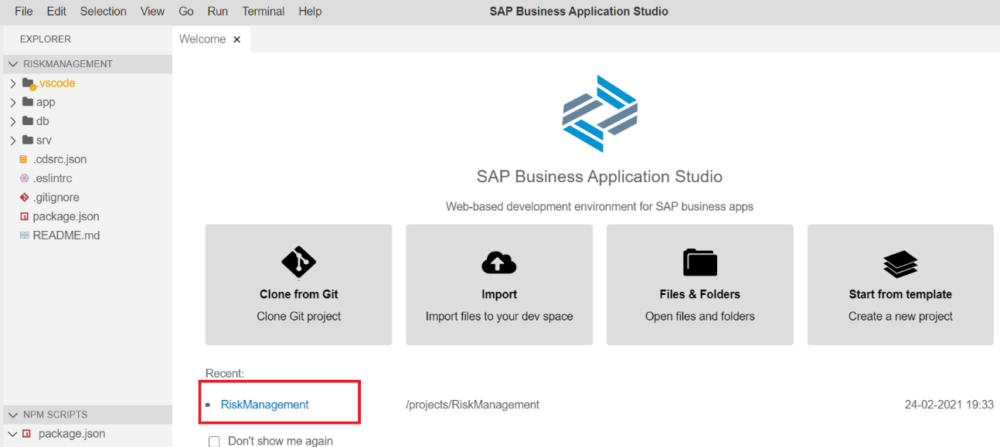
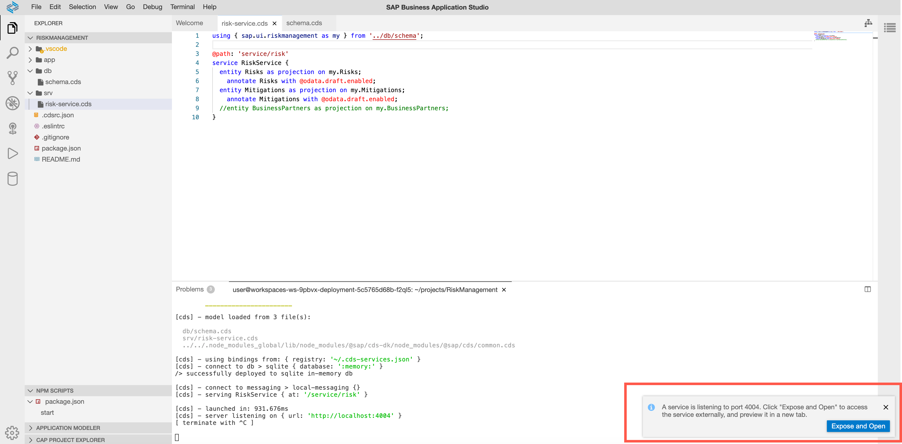
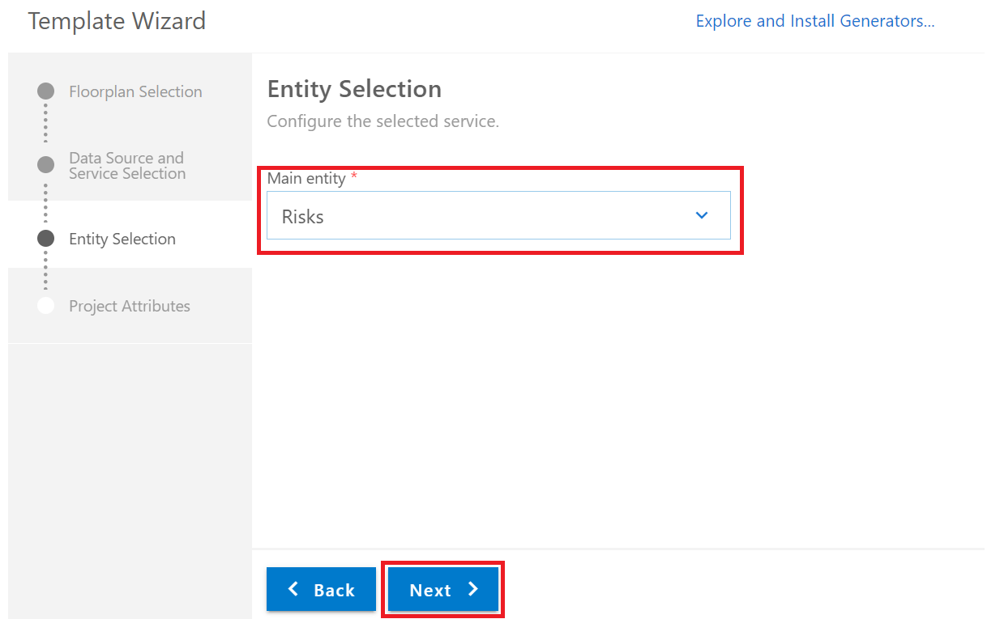
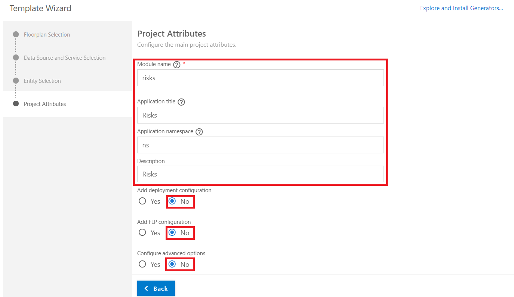

# Exercise 1 - Exercise 1 Description

In this exercise, we will create an application based on a data model and service created using the Cloud Application Programming Model (CAP) and a UI based on Fiori elements (FE) which in turn is based on UI5.

## ###############################################################

## Exercise 1.1 Create a CAP-Based Service

In this part, you create a new CAP-based service, which exposes the OData V4 protocol. To do so, you use CAP's tooling `cds init` and `cds watch` in a terminal.

### Create and Initialize the Project

1. In the Business Application Studio click on **Create project from template**

2. Select **CAP Project** and press **Next**

3. Enter 'RiskManagement' as a project name. Don't tick any of the checkboxes below.

4. After the project has been generated, click on **Open in New Workspace** on the pop up in the lower right corner

5. The new workspace will open and it will show the generated 'RiskManagement' project like this:


6. In VS Code choose **Terminal -> New Terminal** from its menu.

    A new terminal opens in the lower right part of the VS Code screen.

7. In the terminal, start a CAP server by typing:
    ```
    cds watch
    ```
    The CAP server serves all the CAP sources from your project. It also "watches" all the files in your projects and conveniently restarts the server whenever you save a file. Changes you've made, will immediately be served without you having to do anything.

    The screen now looks like this:
    
    Cds watch tells you that there’s no model yet that it can serve. You add one in the next steps.

### Add a Data Model to the Project

In this part we create a data model using the Core Data Services (CDS) format from CAP.

1. In the project, go to folder **db**, representing the data model on the data base, press the right mouse button and select **New File** in the menu
2. Enter **schema.cds*** as a name.
3. Click on the new file in the explorer, an editor opens
4. Enter the following lines into the editor

```javascript
namespace sap.ui.riskmanagement;
using { managed } from '@sap/cds/common';

  entity Risks : managed {
    key ID      : UUID  @(Core.Computed : true);
    title       : String(100);
    owner       : String;
    prio        : String(5);
    descr       : String;
    miti        : Association to Mitigations;
    impact      : Integer;
    //bp          : Association to BusinessPartners;
    criticality : Integer;
  }

  entity Mitigations : managed {
    key ID       : UUID  @(Core.Computed : true);
    description  : String;
    owner        : String;
    timeline     : String;
    risks        : Association to many Risks on risks.miti = $self;
  }
```

5. Save the file

    This creates 2 entities in the namespace **sap.ui.riskmanagement**, **Risks**, and **Mitigations**. Each of them have a key called **ID** and several other properties. a Risk has a mitigation and therefore, the property **miti** has an association to exactly one Mitigation. A Mitigation in turn can be used for many Risks, so it has a "too many" association. They key is automatically filled by CAP, which is exposed to the user of the service with the annotation `@(Core.Computed : true)`.

    At this point, you can neglect the commented property **bp** (as well as the other commented lines further down in the file). All the commented lines are later used and uncommented when you introduce a reference to a Business Partner entity. For now you don't need it, though.

    The screen now looks like this:


    Notice how cds watch reacted to dropping the file. It now tells you that it has a model but there are no service definitions yet and thus it still can’t serve anything. So, you add a service definition.

### Add a Service to the Project

In this part we create a new service with 2 entities, both are projections of the data models that we created in the chapter before.

1. In the project, go to folder **srv**, representing the service, press the right mouse button and select **New File** in the menu
2. Enter **risk-service.cds*** as a name.
3. Click on the new file in the explorer, an editor opens
4. Enter the following lines into the editor

```javascript
using { sap.ui.riskmanagement as my } from '../db/schema';

@path: 'service/risk'
service RiskService {
  entity Risks as projection on my.Risks;
    annotate Risks with @odata.draft.enabled; 
  entity Mitigations as projection on my.Mitigations;
    annotate Mitigations with @odata.draft.enabled;
  //entity BusinessPartners as projection on my.BusinessPartners; 
}
```

  This creates a new service **RiskService** in the namespace **sap.ui.riskmanagement**. This service exposes 2 entities (again just neglect the commented part for the business partner), **Risks**and **Mitigations**, which are both just exposing the entities of the data base schema you’ve created in the step before.

  If you again look at the terminal, you see that cds watch has noticed the new file and now tells us that it serves something:



5. Press the **Expose and Open** button
6. If you are asked to enter a name just press return

You now see this screen:


7. Click the **$metadata** link 

The service already exposes a full blown OData metadata document

8. Now click on the **Risks** link.

This exposes the data for the Risks entity. As there is no data yet, you only see this:

```javascript
{
    @odata.context: "$metadata#Risks",
    value: [ ]
}
```

Don't close the window, you will need it again.

### Add Data for the service
 
In this part we add data to the service. It is local data that is stored in a local data base called SQLite that CAP invokes behind the scences. CAP makes it easy to add such test data to a service, all it needs is a Comma Separated Values file which contains the entities' elements as column headers.

1. In the project, go to folder **db**, , press the right mouse button and select **New Folder** in the menu
2. Enter **data** as a name.
3. On the **data** folder,press the right mouse button and select **New File** in the menu
2. Enter **sap.ui.riskmanagement-Risks.csv** as a name.
5. Click on the new file in the explorer, an editor opens
6. Enter the following lines into the editor

```csv
ID;createdAt;createdBy;title;prio;descr;miti_id;impact
20466922-7d57-4e76-b14c-e53fd97dcb11;2019-10-24;tim.back@sap.com;CFR non-compliance ;3;Recent restructuring might violate CFR code 71;20466921-7d57-4e76-b14c-e53fd97dcb11;10000
20466922-7d57-4e76-b14c-e53fd97dcb12;2019-10-24;tim.back@sap.com;SLA violation with possible termination cause;2;Repeated SAL violation on service delivery for two successive quarters;20466921-7d57-4e76-b14c-e53fd97dcb12;90000
20466922-7d57-4e76-b14c-e53fd97dcb13;2019-10-24;tim.back@sap.com;Shipment violating export control;1;Violation of export and trade control with unauthorized downloads;20466921-7d57-4e76-b14c-e53fd97dcb13;200000
```
7. Save the file
38 On the **data** folder,press the right mouse button and select **New File** in the menu
8. Enter **sap.ui.riskmanagement-Mitigations.csv** as a name.
9. Click on the new file in the explorer, an editor opens
10. Enter the following lines into the editor

```csv
ID;createdAt;createdBy;description;owner;timeline
20466921-7d57-4e76-b14c-e53fd97dcb11;2019-10-24;tim.back@sap.com;SLA violation: authorize account manager to offer service credits for recent delivery issues;suitable BuPa;Q2 2020
20466921-7d57-4e76-b14c-e53fd97dcb12;2019-10-24;tim.back@sap.com;"SLA violation: review third party contractors to ease service delivery challenges; trigger budget review";suitable BuPa;Q3 2020
20466921-7d57-4e76-b14c-e53fd97dcb13;2019-10-24;tim.back@sap.com;Embargo violation: investigate source of shipment request, revoke authorization;SFSF Employee with link possible?;29.03.2020
20466921-7d57-4e76-b14c-e53fd97dcb14;2019-10-24;tim.back@sap.com;Embargo violation: review shipment proceedure and stop delivery until further notice;SFSF Employee with link possible?;01.03.2020
```
11. Save the file

The fils have the name of the namespace of the entities in the data model (e.g. **sap.ui.riskmanagement**), followed by a '-' and the name of the entity (e.g. **Risks**). When adhering to this naming convention CAP recognizes the file as data for the data model and automatically adds it to the built in SQLite data base.
Looking at the contents of the file **sap.ui.riskmanagement-Risks.csv**, the first line contains all the properties from your **Risks** entity. While the other ones are straight forward, consider the **miti_id** property. In your entity, you only have a **miti** property, so where does this come from? **miti** is an association to **Mitigations**, as **Mitigations** could have several key properties, the association on the data base needs to point to all of these, therefore CAP creates a property **<AssocuiationProperty>_<AssociatedEntityKey>** for each key.

As always `cds watch` has noticed the change.

12. Return to the browser window wehere the service is stil shown and press **refresh** in the browser. it will now show values for **Risks**


You’ve now got a full blown OData service, which complies to the OData standard and supports the respective queries without having to code anything but the data model and exposing the service itself.

*Note:* The service is completely exposed without any authentication or authorization check. you extend the service later with such checks.

## ###############################################################

## Create an SAP Fiori Elements-Based Application

An Fiori elements (FE) app is an application that leverages SAPUI5, its controls, and its model view controller (MVC) concepts. As opposed to a plain UI5 or freestyle UI5 app, where one has all the views and controllers as part of one's projects, most of the code of an FE app is outside of the project, managed centrally be the FE team. The code inside one's project only references these central components, which take care of creating the UI according to the latest SAP Fiori design guidelines and cover all the controller logic for you out of the box. The UI can be influenced by OData annotations. They determine, for example, which properties of an OData service make up the columns of a table, which displays the content of the service.

### Generate the UI with an SAP Fiori Elements Template

1. In Bussines Application Studio, invoke the Command Pallete (```View -> Command Palette``` or ```Cmd+Shift+P```) and choose ```Fiori: Open Application Generator```.

  	

2. Choose `SAP Fiori Elements Application` and press **Next**

  	


3. Choose `List Report Object Page` and press **Next**

   	


4. In the next dialog, choose **Use a local CAP Project** and point to the folder of your current ```RiskManagement``` project. Select the ``RiskService`` as the OData service and click **Next**

   	

5.	Choose ```Risks``` as the main entity and click **Next**

   	

6. Enter "risks" as the module name. Enter "Risks" as the application title and the description for the application, as well as "ns" as the namespace. Press **Next**

    

7. Check whether the "Your app will be generated in this folder" path points to the ```app``` folder within your project.   TODO

8. Generate the application.  TODO

The application is now generated and after a couple of seconds you can see it in the ```app``` folder of your project. It contains a ```risks``` and a ```webapp``` folder with a ```Component.js``` file, which is characteristic for a UI5 app. However, the code there’s minimal and it basically inherits its logic from the ```sap/fe/core/AppComponent```.


### Modify the UI with OData Annotations

1. If it's not still running from the previous chapter, execute ```cds watch``` in a terminal and press on the **Open in New Tab** button in the right lower corner. If it is still running from the last chapter it is enough to refresh the brower page were it is running.

    You can now see that ```cds watch``` has discovered an HTML page in your app folder:

   	

2. Click on the link ([/risks/webapp/index.html](http://localhost:4004/risks/webapp/index.html)) for the HTML page. On the launch page that now comes up, click on the ```Risks``` tile. You can now see an application with empty content.

	

	The content of your application is empty because the generated FE app still misses an important part of the settings it needs to run properly in spite of it already being bound to our CAP-based OData service: It’s missing UI annotations.

3. To add the OData annotations, n the project, go to folder **srv**, representing the service, press the right mouse button and select **New File** in the menu

4. Enter **risks-service-ui.cds** as a name.

5. Click on the new file in the explorer, an editor opens

6. Enter the following lines into the editor

```javascript
using RiskService from './risk-service';

annotate RiskService.Risks with {
  title       @title: 'Title';
  owner       @title: 'Owner';
  prio        @title: 'Priority';
  descr       @title: 'Description';   
  miti        @title: 'Mitigation'; 
  //bp          @title: 'Business Partner';   
  impact      @title: 'Impact'; 
}

annotate RiskService.Mitigations with {
	ID @(
		UI.Hidden,
		Common: {
		Text: description
		}
	);    
	description  @title: 'Description';   
	owner        @title: 'Owner'; 
	timeline     @title: 'Timeline';   
	risks        @title: 'Risks'; 
}

annotate RiskService.Risks with @(
	UI: {
		HeaderInfo: {
			TypeName: 'Risk',
			TypeNamePlural: 'Risks'
		},
		SelectionFields: [prio],
		LineItem: [
			{Value: title},
			{Value: miti_ID},
            {Value: owner},
			//{Value: bp_BusinessPartner},
			{
				Value: prio,
				Criticality: criticality 
			}
			,
			{
				Value: impact,
				Criticality: criticality
			}
		],
		Facets: [
			{$Type: 'UI.ReferenceFacet', Label: 'Main', Target: '@UI.FieldGroup#Main'}
		],
		FieldGroup#Main: {
			Data: [
				{Value: title},
				{Value: miti_ID},
				{Value: descr},
                {Value: owner},
				{
					Value: prio,
					Criticality: criticality
				},
				//{Value: bp_BusinessPartner},
				{
					Value: impact,
					Criticality: criticality
				}			
			]
		}		
	},
) {

}; 

annotate RiskService.Risks with {
	miti @(	
		Common: {
			//show text, not id for mitigation in the context of risks
			Text: miti.description  , TextArrangement: #TextOnly,
			ValueList: {
				Label: 'Mitigations',
				CollectionPath: 'Mitigations',
				Parameters: [
					{ $Type: 'Common.ValueListParameterInOut', 
						LocalDataProperty: miti_ID, 
						ValueListProperty: 'ID' 
					},
					{ $Type: 'Common.ValueListParameterDisplayOnly', 
						ValueListProperty: 'description' 
					}                                      
				]
			}
		},
		UI.MultiLineText: IsActiveEntity
	);
  /*
	bp @(	
		Common: {
			Text: bp.LastName  , TextArrangement: #TextOnly,
			ValueList: {
				Label: 'Business Partners',
				CollectionPath: 'BusinessPartners',
				Parameters: [
					{ $Type: 'Common.ValueListParameterInOut', 
						LocalDataProperty: bp_BusinessPartner, 
						ValueListProperty: 'BusinessPartner' 
					},
					{ $Type: 'Common.ValueListParameterDisplayOnly', 
						ValueListProperty: 'LastName' 
					},
					{ $Type: 'Common.ValueListParameterDisplayOnly', 
						ValueListProperty: 'FirstName' 
					}      					                                   
				]
			}
		}
	)	
  */
}

/*
annotate RiskService.BusinessPartners with {
	BusinessPartner @(
		UI.Hidden,
		Common: {
		Text: LastName
		}
	);   
	LastName    @title: 'Last Name';  
	FirstName   @title: 'First Name';   
}
*/
```


7. Save the file

	As in the steps before, ```cds watch``` has noticed the new file and compiled the service again, so now it contains the additional annotations.

4. In the browser, reload the page of the empty FE app. Click Go.

	It now shows a work list with some columns and the data from the service.

   	


You’ve now already finished a full blown service and a full blown UI application on top running locally.

### Check the Annotation Files

Let's have a look at the new cds file and the annotations in there. At the beginning we see:

```javascript
using RiskService from './risk-service';

annotate RiskService.Risks with {
	title       @title: 'Title';
	prio        @title: 'Priority';
	descr       @title: 'Description';
	miti        @title: 'Mitigation';
	//bp          @title: 'Business Partner';
	impact      @title: 'Impact';
}
```

It's referring to the definitions of the earlier cds file that exposes the service and its ```risks``` and mitigations ```entites```. Then it annotates the ```risk``` entity with a number of texts. These should be in a translatable file normally but for now we keep them here. These texts are used as labels in form fields and column headers by FE.

Next up:

```javascript
annotate RiskService.Risks with @(
	UI: {
		HeaderInfo: {
			TypeName: 'Risk',
			TypeNamePlural: 'Risks'
		},
		SelectionFields: [prio],
		LineItem: [
			{Value: title},
			{Value: miti_ID},
			{Value: owner},
			// {Value: bp_BusinessPartner},
			{
				Value: prio,
				Criticality: criticality
			},
			{
				Value: impact,
				Criticality: criticality
			}
		],
		Facets: [
			{$Type: 'UI.ReferenceFacet', Label: 'Main', Target: '@UI.FieldGroup#Main'}
		],
		FieldGroup#Main: {
			Data: [
				{Value: title},
				{Value: miti_ID},
				{Value: descr},
				{Value: owner},
				{
					Value: prio,
					Criticality: criticality
				},
				// {Value: bp_BusinessPartner},
				{
					Value: impact,
					Criticality: criticality
				}
			]
		}
	},
) {

};
```

This defines the content of the work list page and the object page, which one navigates to when clicking on a line in the work list.

The ```SelectionFields``` section defines which of the properties are exposed as search fields in the header bar above the list, in this case ```prio``` is the only explicit search field.

From the ```LineItem``` section all the columns and their order of the work list are derived. While in most cases the columns are defined by ```Value:``` followed by the property name of the entity, in the case of ```prio```and ```impact``` there’s also ```Criticality```, which for now you can neglect but keep in mind in case you go to the later modules. It currently adds a diamond icon ( &#x20df; ) right left of the fields. You can just ignore it.

Next up the ```Facets``` section. In this case, it defines the content of the object page. It contains only a single facet, a ```ReferenceFacet```, of the field group ```FieldGroup#Main```. This field group just shows up as a form. The properties of the ```Data``` array within ```FieldGroup#Main``` determine the fields in the form:


## ###############################################################

## Add Business Logic to Your Application

In this chapter, you add some custom code to the CAP service, that changes, depending on the value of the property ```impact```, the value of the property ```criticality```, which in turn is used in OData annotations to control the color of some of the cells in the table of our work list page.

### Add Custom Code

1. In the project, go to folder **srv**, representing the service, press the right mouse button and select **New File** in the menu
2. Enter **risk-service.js** as a name.
3. Click on the new file in the explorer, an editor opens
4. Enter the following lines into the editor

```javascript
/**
 * Implementation for Risk Management service defined in ./risk-service.cds
 */
module.exports = async (srv) => {
    srv.after('READ', 'Risks', (risks) => {

        risks.forEach((risk) => {
            if (risk.impact >= 100000) {
                risk.criticality = 1;
            } else {
                risk.criticality = 2;
            }
        });
    });
}
```

5. Save the file
6. In the browser, reload the page of the Fiori Elements app.

	It now shows our work list with the columns ```Priority``` and ```Impact``` with color and an icon, depending on the amount in ```impact```.

	

### Explanation of the Custom Code

Because your file is called ```risks-service.js``` and therefore has the same name as your service definition file ```risks-service.cds```, CAP automatically treats it as a handler file for the service defined in there. CAP exposes several [events](https://github.wdf.sap.corp/pages/cap/node.js/api#cds-event-handlers) and you can easily write handlers like the above.

In this case, the event ```after``` is triggered after a `READ` was carried out for our ```Risks``` entity. In your custom handler you get all the data, in this case all the risks that were read according to the query. You can loop over each of them and if needed adjust the data of the response. In this case, you change the value of the ```criticality``` when the ```impact``` is bigger than 100000. The new values for ```criticality``` are then part of the response to the read request.

So, this affects the service's response, but how does this translate into a changed UI? For this, you have to go back to the annotations you created in chapter 3 where you find your ```srv/risks-service-ui.cds``` file. There you had the two columns ```prio``` and ```impact``` annotated with an additional ```Criticality``` annotation. This annotation points to the ```criticality``` property of your service (*Note:* `Criticality` with an upper case `C` is the annotation, while the property name `criticality` could also be called different opposed to the annotation). As you now set different values in your custom handler for ```criticality```, the Fiori Elements application translates these into icons and colors, which you can see in the UI.

```javascript
annotate RiskService.Risks with @(
	UI: {
		...
		...
		LineItem: [
			...
			...
			{
				Value: prio,
				Criticality: criticality
			},
			{
				Value: impact,
				Criticality: criticality
			}
		],
```

You can find more about the possible values of the ```Criticality``` annotation [here](https://github.com/SAP/odata-vocabularies/blob/master/vocabularies/UI.md#CriticalityType). This however is just one of the many sections of the OData Annotation vocabularies for [UI](https://github.com/SAP/odata-vocabularies/blob/master/vocabularies/UI.md) and [Common](https://github.com/SAP/odata-vocabularies/blob/master/vocabularies/Common.md) usage.


Continue to - [Exercise 2](../ex2/README.md)

