# Exercise 1 - Create a Cloud Application Programming Model service and a Fiori Elements application

In this exercise, we will create an application based on a data model and service created using the Cloud Application Programming Model (CAP) and a UI based on Fiori elements (FE) which in turn is based on UI5.

## ###############################################################

## Exercise 1.1 Create a CAP-Based Service

In this part, you create a new CAP-based service, which exposes the OData V4 protocol. To do so, you use CAP's tooling `cds init` and `cds watch` in a terminal.

### Create and Initialize the Project

1. In the Business Application Studio click on **Create project from template**

2. Select **CAP Project** and press **Next**
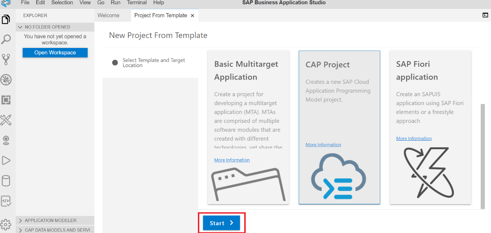
3. Enter 'RiskManagement' as a project name. Don't tick any of the checkboxes below.

4. After the project has been generated, click on **Open in New Workspace** on the pop up in the lower right corner

5. The new workspace will open and it will show the generated 'RiskManagement' project like this:


6. In VS Code choose **Terminal -> New Terminal** from its menu.

    A new terminal opens in the lower right part of the VS Code screen.

7. In the terminal, start a CAP server by typing:
    ```
    cds watch
    ```
    The CAP server serves all the CAP sources from your project. It also "watches" all the files in your projects and conveniently restarts the server whenever you save a file. Changes you've made, will immediately be served without you having to do anything.

    The screen now looks like this:
    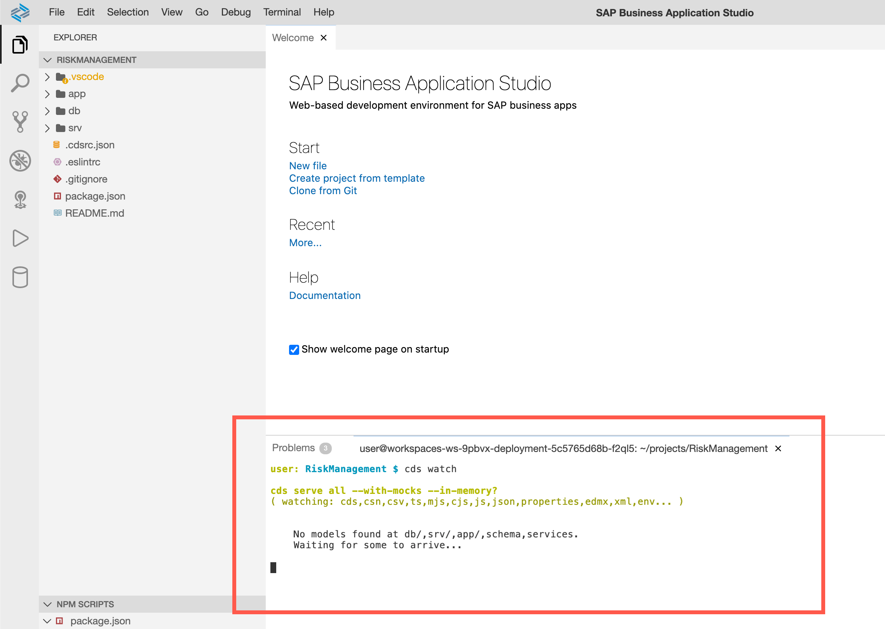
    Cds watch tells you that there’s no model yet that it can serve. You add one in the next steps.

### Add a Data Model to the Project

In this part we create a data model using the Core Data Services (CDS) format from CAP.

1. In the project, go to folder **db**, representing the data model on the data base, press the right mouse button and select **New File** in the menu
2. Enter **schema.cds*** as a name.
3. Click on the new file in the explorer, an editor opens
4. Enter the following lines into the editor

```javascript
namespace sap.ui.riskmanagement;
using { managed } from '@sap/cds/common';

  entity Risks : managed {
    key ID      : UUID  @(Core.Computed : true);
    title       : String(100);
    owner       : String;
    prio        : String(5);
    descr       : String;
    miti        : Association to Mitigations;
    impact      : Integer;
    //bp          : Association to BusinessPartners;
    criticality : Integer;
  }

  entity Mitigations : managed {
    key ID       : UUID  @(Core.Computed : true);
    description  : String;
    owner        : String;
    timeline     : String;
    risks        : Association to many Risks on risks.miti = $self;
  }
```

5. Save the file

    This creates 2 entities in the namespace **sap.ui.riskmanagement**, **Risks**, and **Mitigations**. Each of them have a key called **ID** and several other properties. a Risk has a mitigation and therefore, the property **miti** has an association to exactly one Mitigation. A Mitigation in turn can be used for many Risks, so it has a "too many" association. They key is automatically filled by CAP, which is exposed to the user of the service with the annotation `@(Core.Computed : true)`.

    At this point, you can neglect the commented property **bp** (as well as the other commented lines further down in the file and in subsequent files and chapters). All the commented lines are later used and uncommented when you introduce a reference to a Business Partner entity. For now you don't need it, though.

    The screen now looks like this:

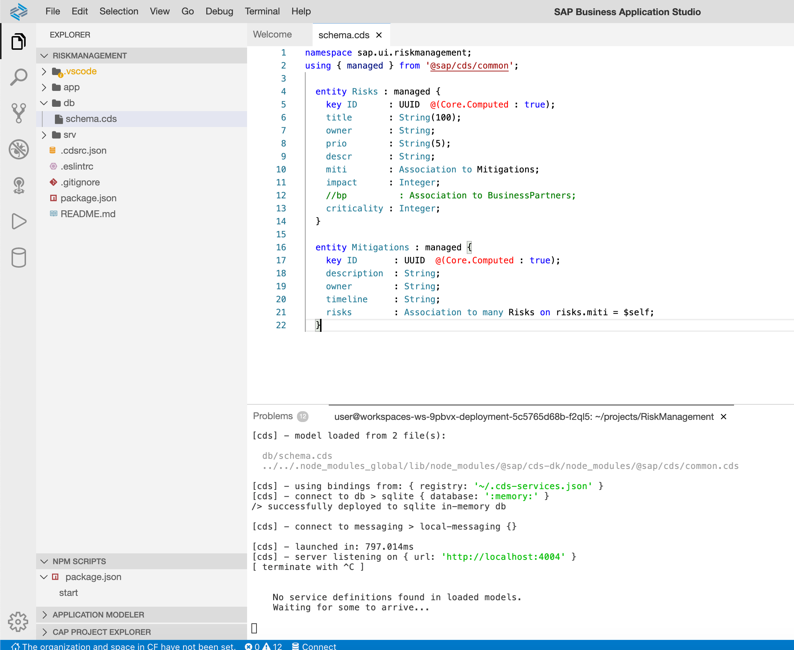


    Notice how cds watch reacted to dropping the file. It now tells you that it has a model but there are no service definitions yet and thus it still can’t serve anything. So, you add a service definition.

### Add a Service to the Project

In this part we create a new service with 2 entities, both are projections of the data models that we created in the chapter before.

1. In the project, go to folder **srv**, representing the service, press the right mouse button and select **New File** in the menu
2. Enter **risk-service.cds*** as a name.
3. Click on the new file in the explorer, an editor opens
4. Enter the following lines into the editor

```javascript
using { sap.ui.riskmanagement as my } from '../db/schema';

@path: 'service/risk'
service RiskService {
  entity Risks as projection on my.Risks;
    annotate Risks with @odata.draft.enabled; 
  entity Mitigations as projection on my.Mitigations;
    annotate Mitigations with @odata.draft.enabled;
  //entity BusinessPartners as projection on my.BusinessPartners; 
}
```

  This creates a new service **RiskService** in the namespace **sap.ui.riskmanagement**. This service exposes 2 entities (again just neglect the commented part for the business partner), **Risks**and **Mitigations**, which are both just exposing the entities of the data base schema you’ve created in the step before.

  If you again look at the terminal, you see that cds watch has noticed the new file and now tells us that it serves something:


5. Press the **Expose and Open** button
6. If you are asked to enter a name just press return

You now see this screen:

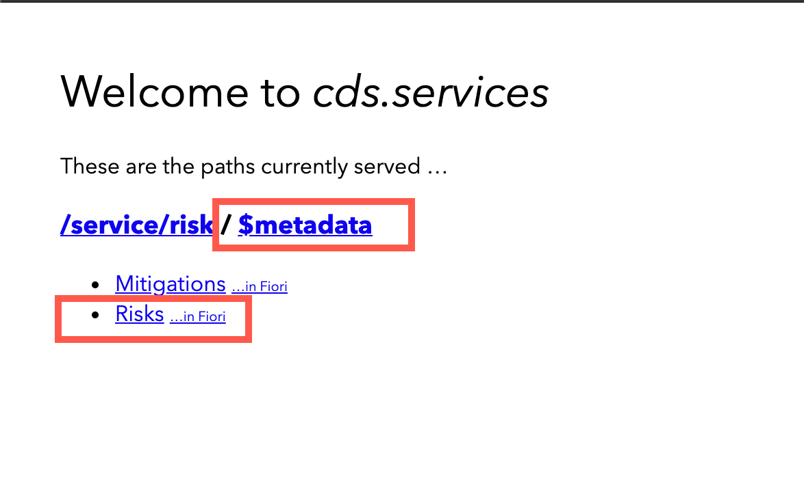

7. Click the **$metadata** link 

The service already exposes a full blown OData metadata document

8. Now click on the **Risks** link.

This exposes the data for the Risks entity. As there is no data yet, you only see this:

```javascript
{
    @odata.context: "$metadata#Risks",
    value: [ ]
}
```

Don't close the window, you will need it again.

### Add Data for the service
 
In this part we add data to the service. It is local data that is stored in a local data base called SQLite that CAP invokes behind the scences. CAP makes it easy to add such test data to a service, all it needs is a Comma Separated Values file which contains the entities' elements as column headers.

1. In the project, go to folder **db**, , press the right mouse button and select **New Folder** in the menu
2. Enter **data** as a name.
3. On the **data** folder,press the right mouse button and select **New File** in the menu
2. Enter **sap.ui.riskmanagement-Risks.csv** as a name.
5. Click on the new file in the explorer, an editor opens
6. Enter the following lines into the editor

```csv
ID;createdAt;createdBy;title;owner;prio;descr;miti_id;impact
20466922-7d57-4e76-b14c-e53fd97dcb11;2019-10-24;tim.back@sap.com;CFR non-compliance;Fred Fish;3;Recent restructuring might violate CFR code 71;20466921-7d57-4e76-b14c-e53fd97dcb11;10000
20466922-7d57-4e76-b14c-e53fd97dcb12;2019-10-24;tim.back@sap.com;SLA violation with possible termination cause;George Gung;2;Repeated SAL violation on service delivery for two successive quarters;20466921-7d57-4e76-b14c-e53fd97dcb12;90000
20466922-7d57-4e76-b14c-e53fd97dcb13;2019-10-24;tim.back@sap.com;Shipment violating export control;Herbert Hunter;1;Violation of export and trade control with unauthorized downloads;20466921-7d57-4e76-b14c-e53fd97dcb13;200000
```
7. Save the file
38 On the **data** folder,press the right mouse button and select **New File** in the menu
8. Enter **sap.ui.riskmanagement-Mitigations.csv** as a name.
9. Click on the new file in the explorer, an editor opens
10. Enter the following lines into the editor

```csv
ID;createdAt;createdBy;description;owner;timeline
20466921-7d57-4e76-b14c-e53fd97dcb11;2019-10-24;tim.back@sap.com;SLA violation: authorize account manager to offer service credits for recent delivery issues;suitable BuPa;Q2 2020
20466921-7d57-4e76-b14c-e53fd97dcb12;2019-10-24;tim.back@sap.com;"SLA violation: review third party contractors to ease service delivery challenges; trigger budget review";suitable BuPa;Q3 2020
20466921-7d57-4e76-b14c-e53fd97dcb13;2019-10-24;tim.back@sap.com;Embargo violation: investigate source of shipment request, revoke authorization;SFSF Employee with link possible?;29.03.2020
20466921-7d57-4e76-b14c-e53fd97dcb14;2019-10-24;tim.back@sap.com;Embargo violation: review shipment proceedure and stop delivery until further notice;SFSF Employee with link possible?;01.03.2020
```
11. Save the file

The fils have the name of the namespace of the entities in the data model (e.g. **sap.ui.riskmanagement**), followed by a '-' and the name of the entity (e.g. **Risks**). When adhering to this naming convention CAP recognizes the file as data for the data model and automatically adds it to the built in SQLite data base.
Looking at the contents of the file **sap.ui.riskmanagement-Risks.csv**, the first line contains all the properties from your **Risks** entity. While the other ones are straight forward, consider the **miti_id** property. In your entity, you only have a **miti** property, so where does this come from? **miti** is an association to **Mitigations**, as **Mitigations** could have several key properties, the association on the data base needs to point to all of these, therefore CAP creates a property **<AssocuiationProperty>_<AssociatedEntityKey>** for each key.

As always `cds watch` has noticed the change.

12. Return to the browser window wehere the service is stil shown and press **refresh** in the browser. it will now show values for **Risks**

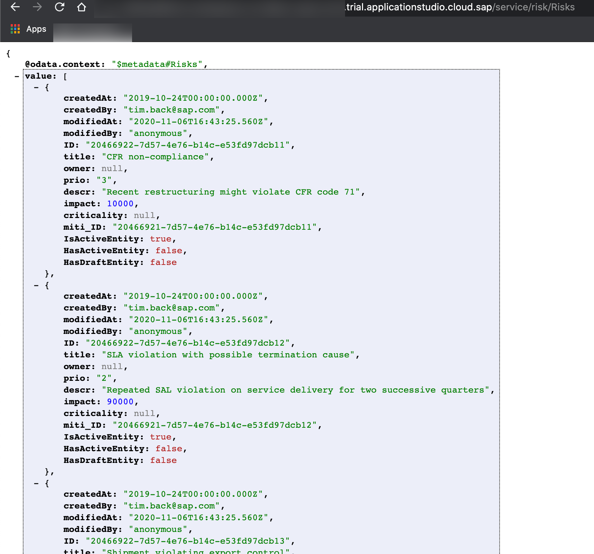


You’ve now got a full blown OData service, which complies to the OData standard and supports the respective queries without having to code anything but the data model and exposing the service itself.

*Note:* The service is completely exposed without any authentication or authorization check. you extend the service later with such checks.

## ###############################################################

## Exercise 1.2 Create an SAP Fiori Elements-Based Application

An Fiori elements (FE) app is an application that leverages SAPUI5, its controls, and its model view controller (MVC) concepts. As opposed to a plain UI5 or freestyle UI5 app, where one has all the views and controllers as part of one's projects, most of the code of an FE app is outside of the project, managed centrally be the FE team. The code inside one's project only references these central components, which take care of creating the UI according to the latest SAP Fiori design guidelines and cover all the controller logic for you out of the box. The UI can be influenced by OData annotations. They determine, for example, which properties of an OData service make up the columns of a table, which displays the content of the service.

### Generate the UI with an SAP Fiori Elements Template

1. In Bussines Application Studio, invoke the Command Pallete (```View -> Command Palette``` or ```Cmd+Shift+P```) and choose ```Fiori: Open Application Generator```.

  	

2. Choose `SAP Fiori Elements Application` and press **Next**

  	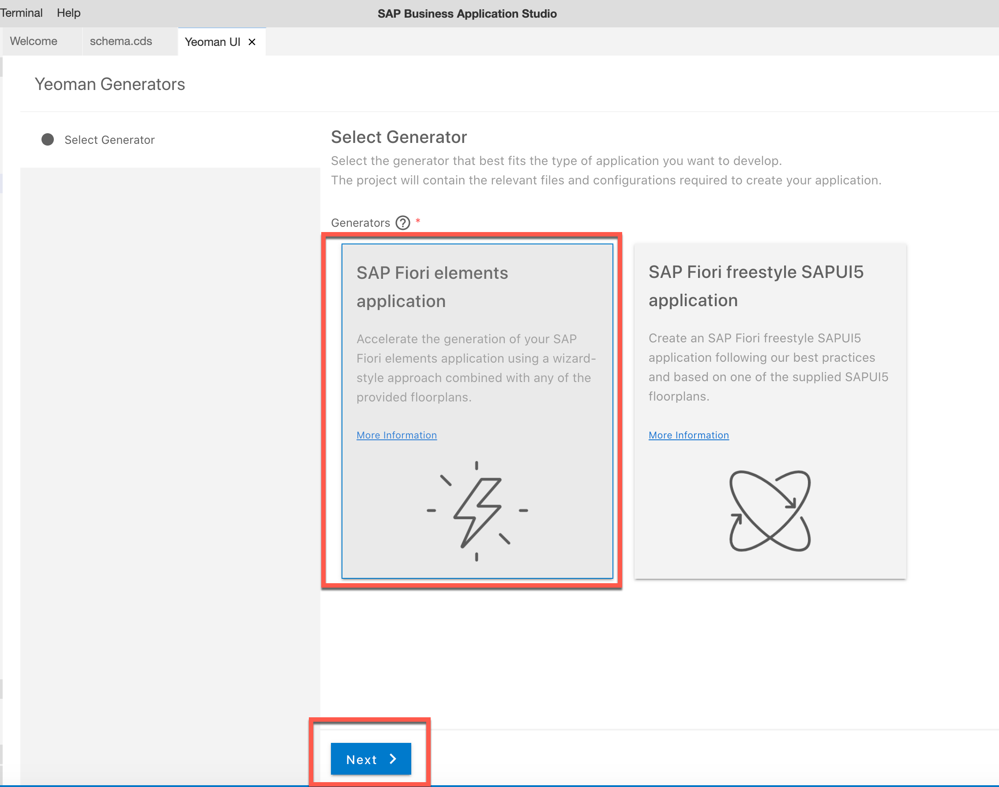


3. Choose `List Report Object Page` and press **Next**

   	


4. In the next dialog, choose **Use a local CAP Project** and point to the folder of your current ```RiskManagement``` project. Select the ``RiskService`` as the OData service and click **Next**

   	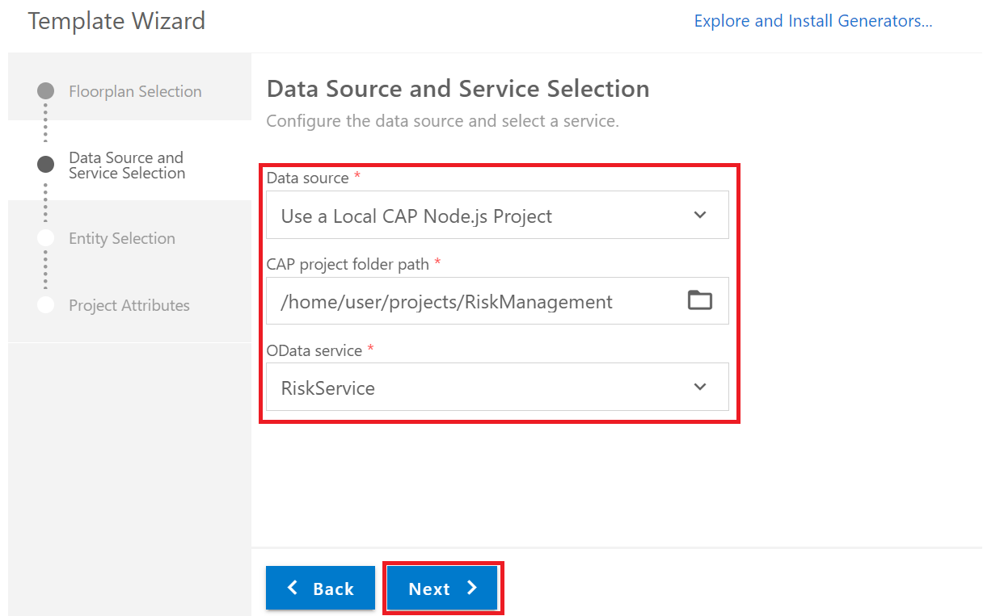

5.	Choose ```Risks``` as the main entity and click **Next**

   	

6. Enter "risks" as the module name. Enter "Risks" as the application title and the description for the application, as well as "ns" as the namespace. Press **Next**

    

7. Check whether the "Your app will be generated in this folder" path points to the ```app``` folder within your project.   TODO

8. Generate the application.  TODO

The application is now generated and after a couple of seconds you can see it in the ```app``` folder of your project. It contains a ```risks``` and a ```webapp``` folder with a ```Component.js``` file, which is characteristic for a UI5 app. However, the code there’s minimal and it basically inherits its logic from the ```sap/fe/core/AppComponent```.


### Modify the UI with OData Annotations

1. If it's not still running from the previous chapter, execute ```cds watch``` in a terminal and press on the **Open in New Tab** button in the right lower corner. If it is still running from the last chapter it is enough to refresh the brower page were it is running.

    You can now see that ```cds watch``` has discovered an HTML page in your app folder:

    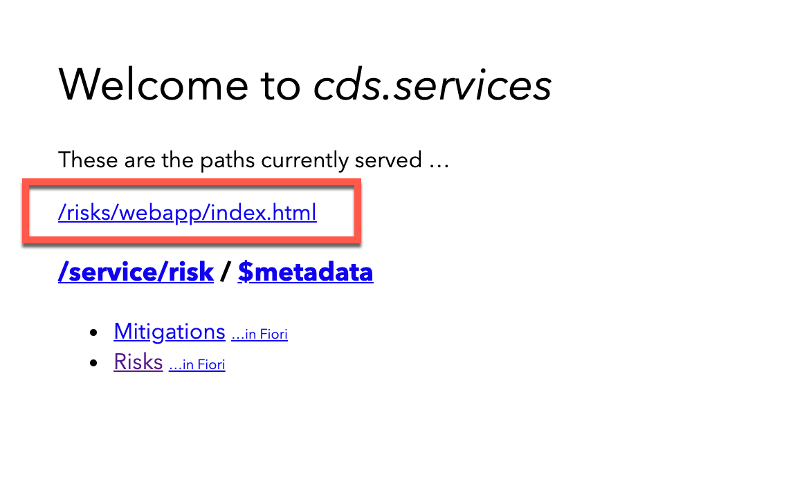

    Unfortunately, clicking on the link doesn't get a result yet, as we miss an essential part of a Fiori elements application it needs to run properly in spite of it already being bound to our CAP-based OData service, it is missing UI annotations 


2. To add the OData annotations, n the project, go to folder **srv**, representing the service, press the right mouse button and select **New File** in the menu

3. Enter **risks-service-ui.cds** as a name.

4. Click on the new file in the explorer, an editor opens

5. Enter the following lines into the editor

```javascript
using RiskService from './risk-service';

annotate RiskService.Risks with {
  title       @title: 'Title';
  owner       @title: 'Owner';
  prio        @title: 'Priority';
  descr       @title: 'Description';   
  miti        @title: 'Mitigation'; 
  //bp          @title: 'Business Partner';   
  impact      @title: 'Impact'; 
}

annotate RiskService.Mitigations with {
	ID @(
		UI.Hidden,
		Common: {
		Text: description
		}
	);    
	description  @title: 'Description';   
	owner        @title: 'Owner'; 
	timeline     @title: 'Timeline';   
	risks        @title: 'Risks'; 
}

annotate RiskService.Risks with @(
	UI: {
		HeaderInfo: {
			TypeName: 'Risk',
			TypeNamePlural: 'Risks'
		},
		SelectionFields: [prio],
		LineItem: [
			{Value: title},
			{Value: miti_ID},
            {Value: owner},
			//{Value: bp_BusinessPartner},
			{
				Value: prio,
				Criticality: criticality 
			}
			,
			{
				Value: impact,
				Criticality: criticality
			}
		],
		Facets: [
			{$Type: 'UI.ReferenceFacet', Label: 'Main', Target: '@UI.FieldGroup#Main'}
		],
		FieldGroup#Main: {
			Data: [
				{Value: title},
				{Value: miti_ID},
				{Value: descr},
                {Value: owner},
				{
					Value: prio,
					Criticality: criticality
				},
				//{Value: bp_BusinessPartner},
				{
					Value: impact,
					Criticality: criticality
				}			
			]
		}		
	},
) {

}; 

annotate RiskService.Risks with {
	miti @(	
		Common: {
			//show text, not id for mitigation in the context of risks
			Text: miti.description  , TextArrangement: #TextOnly,
			ValueList: {
				Label: 'Mitigations',
				CollectionPath: 'Mitigations',
				Parameters: [
					{ $Type: 'Common.ValueListParameterInOut', 
						LocalDataProperty: miti_ID, 
						ValueListProperty: 'ID' 
					},
					{ $Type: 'Common.ValueListParameterDisplayOnly', 
						ValueListProperty: 'description' 
					}                                      
				]
			}
		},
		UI.MultiLineText: IsActiveEntity
	);
  /*
	bp @(	
		Common: {
			Text: bp.LastName  , TextArrangement: #TextOnly,
			ValueList: {
				Label: 'Business Partners',
				CollectionPath: 'BusinessPartners',
				Parameters: [
					{ $Type: 'Common.ValueListParameterInOut', 
						LocalDataProperty: bp_BusinessPartner, 
						ValueListProperty: 'BusinessPartner' 
					},
					{ $Type: 'Common.ValueListParameterDisplayOnly', 
						ValueListProperty: 'LastName' 
					},
					{ $Type: 'Common.ValueListParameterDisplayOnly', 
						ValueListProperty: 'FirstName' 
					}      					                                   
				]
			}
		}
	)	
  */
}

/*
annotate RiskService.BusinessPartners with {
	BusinessPartner @(
		UI.Hidden,
		Common: {
		Text: LastName
		}
	);   
	LastName    @title: 'Last Name';  
	FirstName   @title: 'First Name';   
}
*/
```

7. Save the file

	As in the steps before, ```cds watch``` has noticed the new file and compiled the service again, so now it contains the additional annotations.

4. In the browser, reload the test page which shows the service and the index page. Click on the index page link `/risks/webapp/index.html`. On the launch page that now comes up, click on the **Risks** tile. Click **Go**. It now shows a work list with some columns and the data from the service.

    

    You’ve now already finished a full blown service and a full blown UI application on top running locally.

### Check the Annotation Files

Let's have a look at the new cds file and the annotations in there. At the beginning we see:

```javascript
using RiskService from './risk-service';

annotate RiskService.Risks with {
	title       @title: 'Title';
	prio        @title: 'Priority';
	descr       @title: 'Description';
	miti        @title: 'Mitigation';
	//bp          @title: 'Business Partner';
	impact      @title: 'Impact';
}
```

It's referring to the definitions of the earlier cds file that exposes the service and its ```risks``` and mitigations ```entites```. Then it annotates the ```risk``` entity with a number of texts. These should be in a translatable file normally but for now we keep them here. These texts are used as labels in form fields and column headers by FE.

Next up:

```javascript
annotate RiskService.Risks with @(
	UI: {
		HeaderInfo: {
			TypeName: 'Risk',
			TypeNamePlural: 'Risks'
		},
		SelectionFields: [prio],
		LineItem: [
			{Value: title},
			{Value: miti_ID},
			{Value: owner},
			// {Value: bp_BusinessPartner},
			{
				Value: prio,
				Criticality: criticality
			},
			{
				Value: impact,
				Criticality: criticality
			}
		],
		Facets: [
			{$Type: 'UI.ReferenceFacet', Label: 'Main', Target: '@UI.FieldGroup#Main'}
		],
		FieldGroup#Main: {
			Data: [
				{Value: title},
				{Value: miti_ID},
				{Value: descr},
				{Value: owner},
				{
					Value: prio,
					Criticality: criticality
				},
				// {Value: bp_BusinessPartner},
				{
					Value: impact,
					Criticality: criticality
				}
			]
		}
	},
) {

};
```

This defines the content of the work list page and the object page, which one navigates to when clicking on a line in the work list.

The ```SelectionFields``` section defines which of the properties are exposed as search fields in the header bar above the list, in this case ```prio``` is the only explicit search field.

From the ```LineItem``` section all the columns and their order of the work list are derived. While in most cases the columns are defined by ```Value:``` followed by the property name of the entity, in the case of ```prio```and ```impact``` there’s also ```Criticality```, which for now you can neglect but keep in mind in case you go to the later modules. It currently adds a diamond icon ( &#x20df; ) right left of the fields. You can just ignore it.

Next up the ```Facets``` section. In this case, it defines the content of the object page. It contains only a single facet, a ```ReferenceFacet```, of the field group ```FieldGroup#Main```. This field group just shows up as a form. The properties of the ```Data``` array within ```FieldGroup#Main``` determine the fields in the form:


The last part is the most complicated one:
```js
annotate RiskService.Risks with {
	miti @(	
		Common: {
			//show text, not id for mitigation in the context of risks
			Text: miti.description  , TextArrangement: #TextOnly,
			ValueList: {
				Label: 'Mitigations',
				CollectionPath: 'Mitigations',
				Parameters: [
					{ $Type: 'Common.ValueListParameterInOut', 
						LocalDataProperty: miti_ID, 
						ValueListProperty: 'ID' 
					},
					{ $Type: 'Common.ValueListParameterDisplayOnly', 
						ValueListProperty: 'description' 
					}                                      
				]
			}
		},
		UI.MultiLineText: IsActiveEntity
	);
}
```

Without these lines, we would see the id of the mitigations from the ```miti``` field, in both the list and the object page:

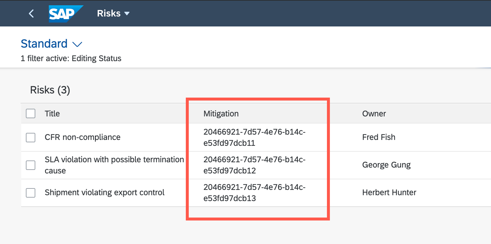

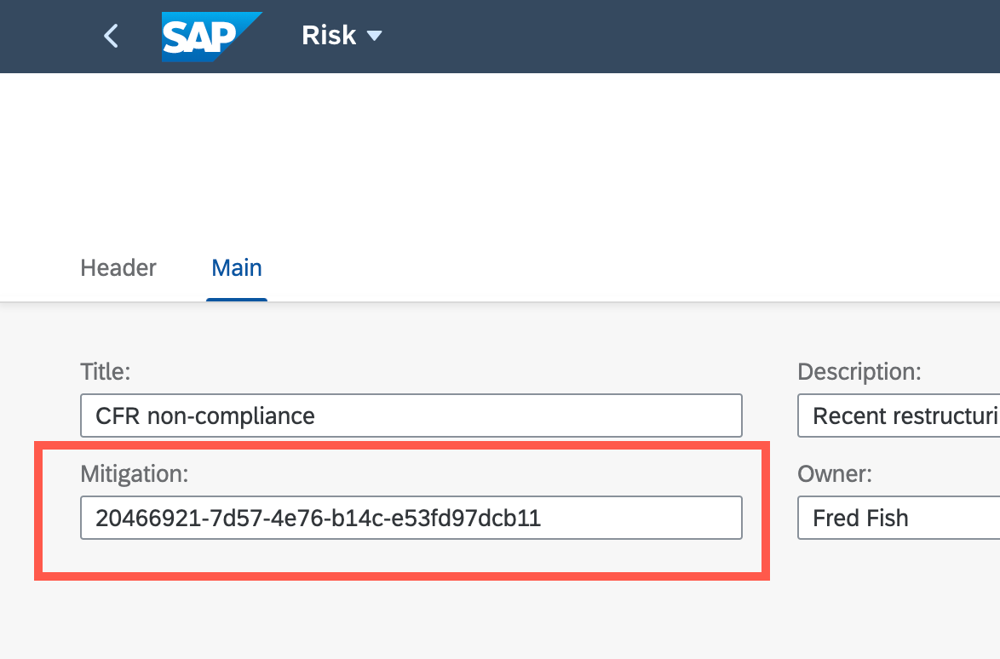

By introducing the annotations for the ```miti``` property, instead of just displaying the original value of ```miti```, i.e. the id, the UI shows its ```description``` property.
The subsequent part ```ValueList``` introduces a value help for ```miti``` that you can see on the object page in its edit mode. the value help takes the id as an input parameter and again displays the ```description``` parameter

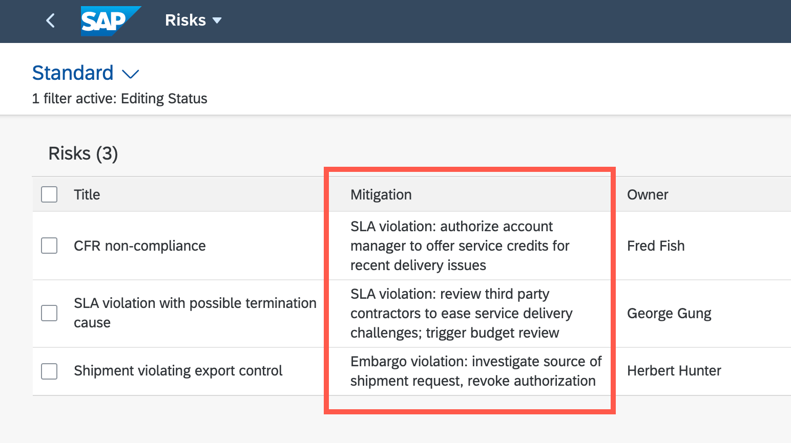

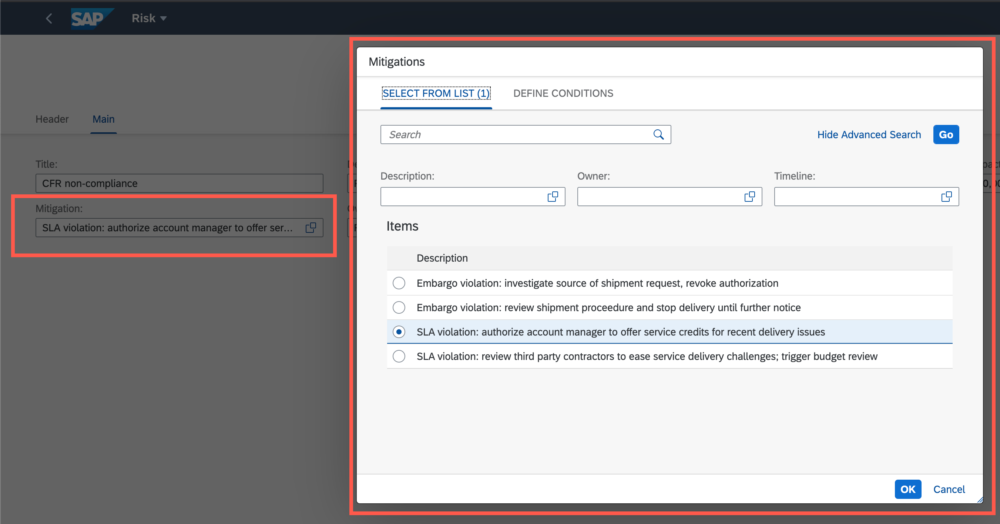


## ###############################################################

## Exercise 1.3 Add Business Logic to Your Application

In this chapter, you add some custom code to the CAP service, that changes, depending on the value of the property ```impact```, the value of the property ```criticality```, which in turn is used in OData annotations to control the color of some of the cells in the table of our work list page.

### Add Custom Code

1. In the project, go to folder **srv**, representing the service, press the right mouse button and select **New File** in the menu
2. Enter **risk-service.js** as a name.
3. Click on the new file in the explorer, an editor opens
4. Enter the following lines into the editor

```javascript
/**
 * Implementation for Risk Management service defined in ./risk-service.cds
 */
module.exports = async (srv) => {
    srv.after('READ', 'Risks', (risks) => {

        risks.forEach((risk) => {
            if (risk.impact >= 100000) {
                risk.criticality = 1;
            } else {
                risk.criticality = 2;
            }
        });
    });
}
```

5. Save the file
6. In the browser, reload the page of the Fiori Elements app.

	It now shows our work list with the columns ```Priority``` and ```Impact``` with color and an icon, depending on the amount in ```impact```.

	

### Explanation of the Custom Code

Because your file is called ```risks-service.js``` and therefore has the same name as your service definition file ```risks-service.cds```, CAP automatically treats it as a handler file for the service defined in there. CAP exposes several [events](https://github.wdf.sap.corp/pages/cap/node.js/api#cds-event-handlers) and you can easily write handlers like the above.

In this case, the event ```after``` is triggered after a `READ` was carried out for our ```Risks``` entity. In your custom handler you get all the data, in this case all the risks that were read according to the query. You can loop over each of them and if needed adjust the data of the response. In this case, you change the value of the ```criticality``` when the ```impact``` is bigger than 100000. The new values for ```criticality``` are then part of the response to the read request.

So, this affects the service's response, but how does this translate into a changed UI? For this, you have to go back to the annotations you created in chapter 3 where you find your ```srv/risks-service-ui.cds``` file. There you had the two columns ```prio``` and ```impact``` annotated with an additional ```Criticality``` annotation. This annotation points to the ```criticality``` property of your service (*Note:* `Criticality` with an upper case `C` is the annotation, while the property name `criticality` could also be called different opposed to the annotation). As you now set different values in your custom handler for ```criticality```, the Fiori Elements application translates these into icons and colors, which you can see in the UI.

```javascript
annotate RiskService.Risks with @(
	UI: {
		...
		...
		LineItem: [
			...
			...
			{
				Value: prio,
				Criticality: criticality
			},
			{
				Value: impact,
				Criticality: criticality
			}
		],
```

You can find more about the possible values of the ```Criticality``` annotation [here](https://github.com/SAP/odata-vocabularies/blob/master/vocabularies/UI.md#CriticalityType). This however is just one of the many sections of the OData Annotation vocabularies for [UI](https://github.com/SAP/odata-vocabularies/blob/master/vocabularies/UI.md) and [Common](https://github.com/SAP/odata-vocabularies/blob/master/vocabularies/Common.md) usage.


## ###############################################################

## Exercise 1.4 Add the Consumption of an External Service Exposed by SAP API Business Hub to Your Service


In this chapter, you extend your CAP service with the consumption of an external Business Partner service. You get its definition from SAP's SAP API Business Hub. First, work with local data and later on get the data directly from the external SAP S/4HANA system.  TODO

### Get the Business Partner EDMX File

1. Open the [SAP API Business Hub](https://api.sap.com/) page in your browser.
2. Type "business partner" into the page's search field and carry out the search.
3. On the left side, expand ```Products``` and mark ```SAP S/4 HANA Cloud```.
4. In the result list, choose on ```Business Partner (A2X)```.
5. Choose the ```Details``` tab.

    

6. Choose the ```Download Specification``` button.
7. Choose the ```EDMX``` option from the list (if you’re asked to log on, log on).

    If you’re using Chrome as a browser, you now see the downloaded file in the footer bar:
    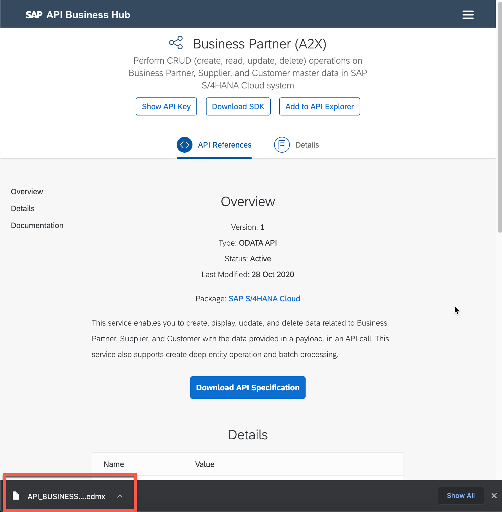


### Add the EDMX File to the Project and Add Local Data

1. Make sure in your VS Code ```cds watch``` is still running.
2. Drag the ```API_BUSINESS_PARTNER.edmx``` file from your browser's download area/folder onto your VS Code workplace and drop it into the ```srv``` folder of your ```cpapp``` app.

    CAP has noticed the new file and automatically created a new ```external``` folder under ```srv``` and in it added a new ```API_BUSINESS_PARTNER.csn``` file. ([CSN](https://github.wdf.sap.corp/pages/cap/cds/csn) being a compact representation of CDS)


3. In your project, open the ```db/schema.cds``` file again and change these parts of the file:


```javascript
namespace sap.ui.riskmanagement;
using { managed } from '@sap/cds/common';
  entity Risks : managed {
    key ID      : UUID  @(Core.Computed : true);
    title       : String(100);
    prio        : String(5);
    descr       : String;
    miti        : Association to Mitigations;
    impact      : Integer;
    //bp          @title: 'Business Partner';   
    criticality : Integer;
  }
  entity Mitigations : managed {
    key ID       : UUID  @(Core.Computed : true);
    description  : String;
    owner        : String;
    timeline     : String;
    risks        : Association to many Risks on risks.miti = $self;
  }
  ```
  ```diff
+ // using an external service from S/4
+ using {  API_BUSINESS_PARTNER as external } from '../srv/external/API_BUSINESS_PARTNER.csn';
+
+ entity BusinessPartners as projection on external.A_BusinessPartner {
+    key BusinessPartner,
+    LastName,
+    FirstName
+  }
```

  With this code, you create a so-called projection for your new service. Of the many entities and properties in these entities, that are defined in the ```API_BUSINESS_PARTNER``` service, you just look at one of the entities (```A_BusinessPartner```) and just three of its properties: ```BusinessPartner```, ```LastName```, and ```FirstName```, so your projection is using a subset of everything the original service has to offer.

4. Open the ```srv/risk-service.cds``` file.

5. Uncomment the ```entity BusinessPartner``` line.

```javascript
using { sap.ui.riskmanagement as my } from '../db/schema';
@path: 'service/risk'
service RiskService {
  entity Risks as projection on my.Risks;
    annotate Risks with @odata.draft.enabled;
  entity Mitigations as projection on my.Mitigations;
    annotate Mitigations with @odata.draft.enabled;
```
```diff
-  //entity BusinessPartners as projection on my.BusinessPartners;
+  entity BusinessPartners as projection on my.BusinessPartners;
}
```

6. In your browser where the Fiori elements app is still running from the last chapter press on the SAP icon on the left upper corner. With this you navigate back to the index page. Press refresh in your browser. Now press on the **Risks** tile and in the application press **Go**

    The browser now shows a ```BusinessPartner```service next to the ```Mitigations``` and ```Risks```

    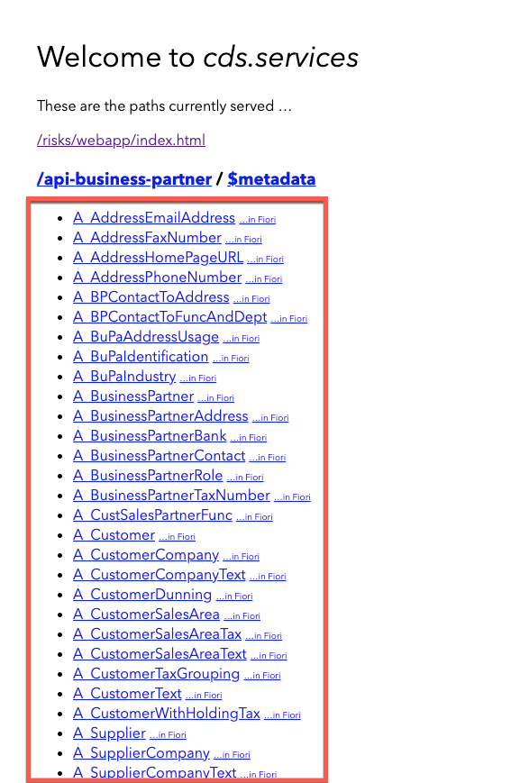

    At this point, you've a new service exposed with a definition based on the original edmx file. However, it doesn't have any connectivity to a backend and thus, there’s no data yet. Like with your own entities ```risks``` and ```mitigations``` you create some local data.

7. In the project, go to folder **srv/external**, press the right mouse button and select **New Folder** in the menu
8. Enter **data** as a name.
9. On the **data** folder,press the right mouse button and select **New File** in the menu
10. Enter **API_BUSINESS_PARTNER-A_BusinessPartner.csv** as a name.
11. Click on the new file in the explorer, an editor opens
12. Enter the following lines into the editor

```csv
BusinessPartner;LastName;FirstName
1004155;Watson;Alice
1004161;Lynotte;Phil
1004100;Masci;J
``` 

13. Save the file

14. Open the ```srv/risk-service.js``` file.

15. Add the following lines at the end of the file:

```javascript
/**
 * Implementation for Risk Management service defined in ./risk-service.cds
 */
module.exports = async (srv) => {
    srv.after('READ', 'Risks', (risks) => {
        risks.forEach((risk) => {
            if (risk.impact >= 100000) {
                risk.criticality = 1;
            } else {
                risk.criticality = 2;
            }
        });
    });
```
```diff
+
+    const BupaService = await cds.connect.to('API_BUSINESS_PARTNER');
+    srv.on('READ', srv.entities.BusinessPartners, async (req) => {
+        return await BupaService.tx(req).run(req.query);
+    });
```
```javascript
}
```

You've now created a custom handler for your service. This time it called ```on``` for the ```READ``` event. 

It is invoked when your ```BusinessPartner``` service is called for a read, so whenever there’s a request for business partner data, this handler is called. It makes sure the request for the business partner is directed to the external business partner service.

16. Save the file

17. In your browser, open the ```BusinessPartners``` link to see the data.

    

    In the next step, you change the code, so the data is fetched from the actual service in an SAP S/4HANA Cloud system.


## ###############################################################

## Exercise 1.5 Consume the External Service in Your UI Application

In this chapter, you incorporate the external service into the UI application.

1. Open the ```db/schema.cds``` file.
2. Uncomment the ```bp``` property.

```javascript
namespace sap.ui.riskmanagement;
using { managed } from '@sap/cds/common';
  entity Risks : managed {
    key ID      : UUID  @(Core.Computed : true);
    title       : String(100);
    prio        : String(5);
    descr       : String;
    miti        : Association to Mitigations;
    impact      : Integer;
  ```
  ```diff
  - //bp          @title: 'Business Partner';   
  + bp          @title: 'Business Partner';  
  ```
  ```javascript
    criticality : Integer;
  }
  entity Mitigations : managed {
    key ID       : UUID  @(Core.Computed : true);
    description  : String;
    owner        : String;
    timeline     : String;
    risks        : Association to many Risks on risks.miti = $self;
  }
  // using an external service from S/4
  using {  API_BUSINESS_PARTNER as external } from '../srv/external/API_BUSINESS_PARTNER.csn';
  entity BusinessPartners as projection on external.A_BusinessPartner {
    key BusinessPartner,
    LastName,
    FirstName
  }
```

	As you got a new property in your entity, you need to add data for this property in the local data file that you've created before for the ```risk``` entity.


3. Opem the file `sap.ui.riskmanagement-Risks.csv` in your `db/data` folder.
4. Replace the content with the new content below which additionally includes the BP data

```csv
ID;createdAt;createdBy;title;owner;prio;descr;miti_id;impact;bp_BusinessPartner
20466922-7d57-4e76-b14c-e53fd97dcb11;2019-10-24;tim.back@sap.com;CFR non-compliance;Fred Fish;3;Recent restructuring might violate CFR code 71;20466921-7d57-4e76-b14c-e53fd97dcb11;10000;1004155
20466922-7d57-4e76-b14c-e53fd97dcb12;2019-10-24;tim.back@sap.com;SLA violation with possible termination cause;George Gung;2;Repeated SAL violation on service delivery for two successive quarters;20466921-7d57-4e76-b14c-e53fd97dcb12;90000;1004161
20466922-7d57-4e76-b14c-e53fd97dcb13;2019-10-24;tim.back@sap.com;Shipment violating export control;Herbert Hunter;1;Violation of export and trade control with unauthorized downloads;20466921-7d57-4e76-b14c-e53fd97dcb13;200000;1004100
```

5. Save the file

  If you check the content of the file, you see numbers like ```1004155``` at the end of the lines, representing business partners.


### Add the Business Partner Field to the UI

Now, you also introduce the business partner field in the UI. For this you need to do several things:

- You add a label for the columns in the result list table as well as in the object page by adding a title annotation.
- You add the business partner as a line item to include it as a column in the result list.
- You add the business partner as a field to a field group, which makes it appear in a form on the object page.

All this happens in the cds file that has all the UI annotations.

1. Open the ```srv/risks-service-ui.cds``` file..
2. Uncomment the following parts:

```javascript 
	using RiskService from './risk-service';

	annotate RiskService.Risks with {
		...
```
```diff
-     //bp          @title: 'Business Partner';
+     bp          @title: 'Business Partner';
```
```javascript
      ...
	}


	annotate RiskService.Risks with @(
		UI: {
			...
			LineItem: [
				...
```
```diff
-       //{Value: bp_BusinessPartner},
+				{Value: bp_BusinessPartner},
```
```javascript
				...
			],
			...
			FieldGroup#Main: {
				Data: [
					...
```
```diff
+         //{Value: bp_BusinessPartner},
-					{Value: bp_BusinessPartner},
```
```javascript
					...
				]
			}
		},
	) {

	};


annotate RiskService.Risks with {
	miti @(	
		Common: {
			//show text, not id for mitigation in the context of risks
			Text: miti.description  , TextArrangement: #TextOnly,
			ValueList: {
				Label: 'Mitigations',
				CollectionPath: 'Mitigations',
				Parameters: [
					{ $Type: 'Common.ValueListParameterInOut', 
						LocalDataProperty: miti_ID, 
						ValueListProperty: 'ID' 
					},
					{ $Type: 'Common.ValueListParameterDisplayOnly', 
						ValueListProperty: 'description' 
					}                                      
				]
			}
		},
		UI.MultiLineText: IsActiveEntity
	);
```
```diff
-  /*
```
```js
	bp @(	
		Common: {
			Text: bp.LastName  , TextArrangement: #TextOnly,
			ValueList: {
				Label: 'Business Partners',
				CollectionPath: 'BusinessPartners',
				Parameters: [
					{ $Type: 'Common.ValueListParameterInOut', 
						LocalDataProperty: bp_BusinessPartner, 
						ValueListProperty: 'BusinessPartner' 
					},
					{ $Type: 'Common.ValueListParameterDisplayOnly', 
						ValueListProperty: 'LastName' 
					},
					{ $Type: 'Common.ValueListParameterDisplayOnly', 
						ValueListProperty: 'FirstName' 
					}      					                                   
				]
			}
		}
	)	
```
```diff
-  */
-
-/*
```
```js
annotate RiskService.BusinessPartners with {
	BusinessPartner @(
		UI.Hidden,
		Common: {
		Text: LastName
		}
	);   
	LastName    @title: 'Last Name';  
	FirstName   @title: 'First Name';   
}
```
```diff
-*/
````
```js
}
```

What does this mean? The first parts that are getting rid of the comments are easy: They just enable the title and add the business partner first as a column to the list and then as a field to the object page, just like other columns and fields were added before. 

The larger part of new annotations activates the same qualitites for the ```bp``` field as it happened before in exercise 1.2 for the ```miti``` field: Instead of showing the id of the business partner, its ```LastName```property is displayed. The ```ValueList``` part introduces a value list for the business partner and shows it last and first name in it.


3. Save the file
4. Open the ```srv/risk-service.js``` file.
5. Add the following lines to the file:

```js
module.exports = async (srv) => {
    srv.after('READ', 'Risks', (risks) => {

        risks.forEach((risk) => {
            if (risk.impact >= 100000) {
                risk.criticality = 1;
            } else {
                risk.criticality = 2;
            }
        });
    });

    const BupaService = await cds.connect.to('API_BUSINESS_PARTNER');
    srv.on('READ', srv.entities.BusinessPartners, async (req) => {
        return await BupaService.tx(req).run(req.query);
    });
```
```diff
+
+    srv.on('READ', 'Risks', async (req, next) => {
+        /*
+        Check whether the request want an "expand" of the business partner
+        As this is not possible, the risk entity and the business partner entity are in different systems (Cloud Platform and S/4 HANA Cloud),
+        if there is such an expand, remove it
+        */
+        const expandIndex = req.query.SELECT.columns.findIndex(({ expand, ref }) => expand && ref[0] === 'bp');
+        console.log(req.query.SELECT.columns)
+        if (expandIndex < 0) return next();
+
+        req.query.SELECT.columns.splice(expandIndex, 1);
+        if (!req.query.SELECT.columns.find( column => column.ref.find( ref => ref == "bp_BusinessPartner" ))) {
+            req.query.SELECT.columns.push({ ref: ["bp_BusinessPartner"] });
+        }
+        
+        /*
+        Instead of carrying out the expand, issue a separate request for each business partner
+        This code could be optimized, instead of having n requests for n business partners, just on bulk request could be created
+        */
+        const res = await next();
+        await Promise.all( 
+            res.map( async risk => {
+                const bp = await BupaService
+                    .tx(req)
+                    .run(SELECT.one(srv.entities.BusinessPartners).where({ BusinessPartner: risk.bp_BusinessPartner })
+                    .columns([ "BusinessPartner", "LastName", "FirstName" ]));
+                risk.bp = bp;
+                console.dir(risk.bp)
+            }
+        ));
+        return res;
+    });
```
```js
}
```

Again you have now added a custom handler, this on is called ```on``` a ```READ``` of the ```Risks``` service. It checks whether the request includes a so-called expand for business partners. This is a request that is issued by the UI when the list should be filled. While it mostly contains columns that directly belong to the ```Risks``` entity, it also contains the business partner. As we have seen in the annotation file, instead of showing the id of the business partner, the last name of the business partner will be shown. This data is in the business partner and not in the risks entity. Therefore, the UI wants to exand, i.e. for each risk the corresponing business partner is also read.

However, there is an issue with this: The ```Risk``` entity is from the Cloud Platform, the busines partner however, is potentially from a remote S/4 HANA Cloud system, in such a case the expand cannot be carried out. Because of this, we need to remove the expand from the request. Instead the code issues separate requests for each business parnter directly to the business partner service. As the code stands, for each risk there is a separate request for a business partner. This is not optimal, it would be better if all the business partners were fetched in a bulk request. You can make this change on your own if you like!

6. Save the file
7. In your tab with the application, go back to the **index.html** page and press refresh 

8. On the launch page that now comes up, choose the **Risks** tile and then Click Go.

	You now see the ```Risks``` application with the business partner in both the result list and the object page, which is loaded when you choose on one of the rows in the table:

	

	


## ###############################################################

## Exercise 1.6  Roles and Authorization Checks In CAP

In this exercise we will add authorizations to the CAP service, so that only users with the right authorization can view the data or even edit and create data. We will also add a mock user locally to test the funcitonality

### Enable Authentication Support

The enable authentication support in CAP, a node.js module called `passport`  needs to be installed.

1. Navigate to your ```RiskManagement``` folder in a terminal in the Business Application Studio. With your ***cds watch** still running in one terminal, it is the easiest to open another second terminal next to it, by invoking **Terminal** and the **New Terminal** in the menu. Alternatively, you can also suspend **cds watch** in your existing terminal by pressing **CTRL+C**. In both cases you should already be in the ```Riskmanagement```folder

2. Install the ```passport``` module. (the --save part makes sure it’s also added as a dependency to your project's ```package.json```)

    ```bash
    npm install --save passport
    ```

### Adding Cap Role Restrictions to Entities

Here we add the authorizations to the ```Risks``` service

1. Open the file ```srv/risk-service.cds```.

2. Change the code in the following way and by this add the  restrictions (`@(...)`) block to your `Risks` and `Mitigations` entities.

```js
using { sap.ui.riskmanagement as my } from '../db/schema';
@path: 'service/risk'
service RiskService {
```
```diff
-  entity Risks as projection on my.Risks;
+  entity Risks @(restrict : [
+            {
+                grant : [ 'READ' ],
+                to : [ 'RiskViewer' ]
+            },
+            {
+                grant : [ '*' ],
+                to : [ 'RiskManager' ]
+            }
+        ]) as projection on my.Risks;
```
```js
    annotate Risks with @odata.draft.enabled;
```
```diff
-  entity Mitigations as projection on my.Mitigations;
+  entity Mitigations @(restrict : [
+            {
+                grant : [ 'READ' ],
+                to : [ 'RiskViewer' ]
+            },
+            {
+                grant : [ '*' ],
+                to : [ 'RiskManager' ]
+            }
+        ]) as projection on my.Mitigations;
```
```js
    annotate Mitigations with @odata.draft.enabled;
  entity BusinessPartners as projection on my.BusinessPartners;
}
```

With this change users that hae the role `RiskViewer` assigned can view ("read") risks and mitigations, and a user with role `RiskManager` can view and change risks and mitigations, they are granted all the authorizations ("*").

### Add Users for Local Testing

Since the authorization checks have been added to the CAP model, they apply not only when deployed to the cloud but also for local testing. Therefore, we need a way to log in to the application locally.

CAP offers a possibility to add local users for testing as part of the `cds` configuration. In this tutorial, we use the `.cdsrc.json` file to add the users.


1. In the project, go to the files **.cdsrc.json** and open it for editing
2. EIn the editor, replace its content with the following lines

```json
{
    "[development]": {
    "auth": {
      "passport": {
        "strategy": "mock",
        "users": {
          "risk.viewer@tester.sap.com": {
            "password": "initial",
            "ID": "riskviewer",
            "userAttributes": {
              "email": "risk.viewer@tester.sap.com"
            },
            "roles": [
              "RiskViewer"
            ]
          },
          "risk.manager@tester.sap.com": {
            "password": "initial",
            "ID": "riskmanager",
            "userAttributes": {
              "email": "risk.manager@tester.sap.com"
            },
            "roles": [
              "RiskManager"
            ]
          }
        }
      }
    }
  }
}
```

3. Save the file

    The file defines two users `riskviewer` and `riskmanager`.Let's look at the `riskmanager` example.


    The user is defined by an `ID`, which cn be any identifier for a user. The user has an `email`, a `password` parameter, and a `roles` parameter. To log on, the `ID`

### Access the Risk Application with a User and Password

When accessing the `Risks` or the `Mitigations` service in the browser, you get a basic authorisation popup now, asking for your user and password. You can use the two users to log in and see that it works.

1. In the tab with the running application, navigate back to the launchpage, press refresh in the browser. 

2. Choose the **Risks** tile and in the app press **Go**.

3. In the pop up, enter *Username*: `riskmanager`.

4. Enter *Password*: `initial`.


You can now access the Risks application.

Unfortunately, there’s no logout functionality. However, you can use the "Clear Browser Cache" function or simply close all browser windows to get rid of the basic auth login data in the browser.

## ###############################################################

## Exercise 1.7  Prepare for Cloud Platform Deployment

Up to this point, the whole application, its data model, its service and its UI application was running locally in you Business Application Studio workspace. Even though we don't cover it in this tutorial, the same would have been possible on you laptop / PC with extensions for Microsoft's Visual Code. 

From this point on, we will prepare the application for a deployment to the SAP Cloud Platform. In [Exercise 2](../ex2/README.md) a Continuous Integration / Continuous Delivery (CI/CD) Service is introduced that takes care of the deployment every time there is a change in the source code.

### Prepare for SAP HANA deployment

While the locally running application uses an in memory SQLite data base, the deployed version will use SAP HANA. CAP helps you with the creation of the database and the deployment of the test data. At runtime it knows which data base to connect to.

In order for this to work, please carry out these steps:

1. Open a new terminal in BAS (**Terminal**->**New Terminal**)
2. In the terminal, run the following, to install the hdb modle and automatically add it as a dependency into the `package.json` file of your project:

```
npm install hdb --save
```

3. In you project, open the `package.json` file and add the following lines:

```json
{
  "name": "cpapp",
  ...
  "cds": {
    "requires": {
```
```diff
+      "db": {
+        "kind": "sql"
+      },
```
```json
      "API_BUSINESS_PARTNER": {
        "kind": "odata",
        "model": "srv/external/API_BUSINESS_PARTNER",
        "credentials": {
          "destination": "cap-api098"
        }
      }
```
```diff
-    }
+    },
+    "hana": {
+      "deploy-format": "hdbtable"
+    }
```
```json
  }
}
```


Continue to - [Exercise 2](../ex2/README.md)

