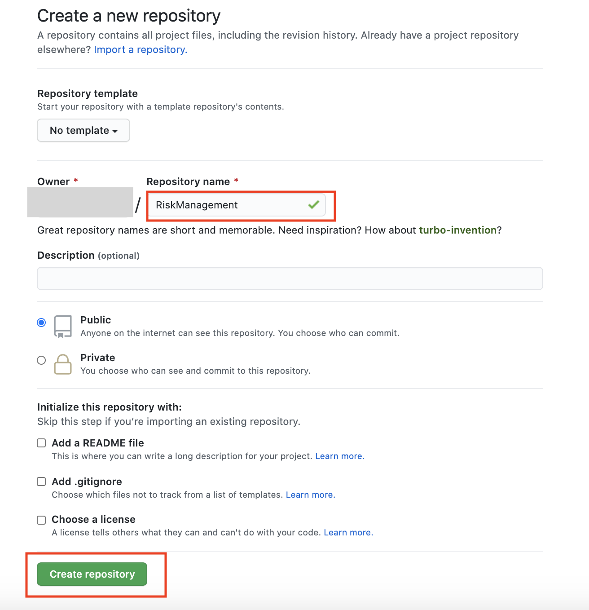
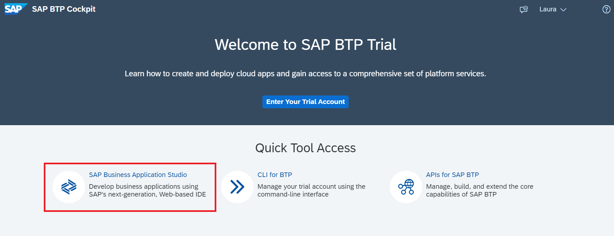
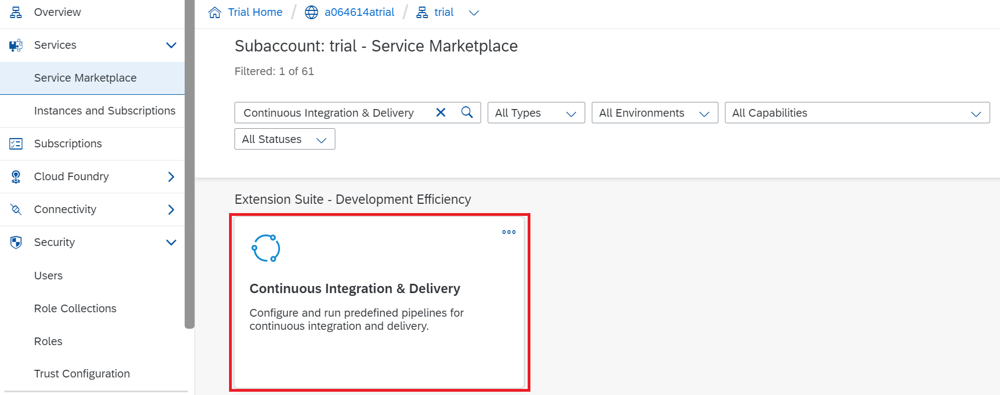
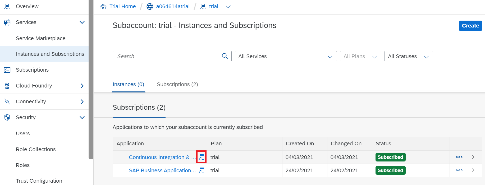
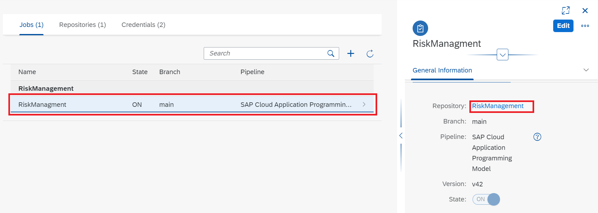
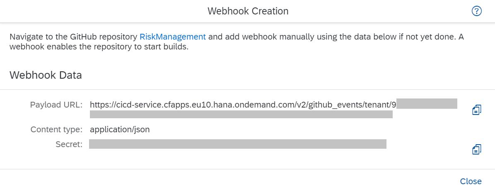
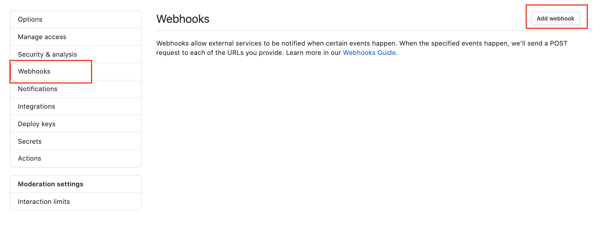
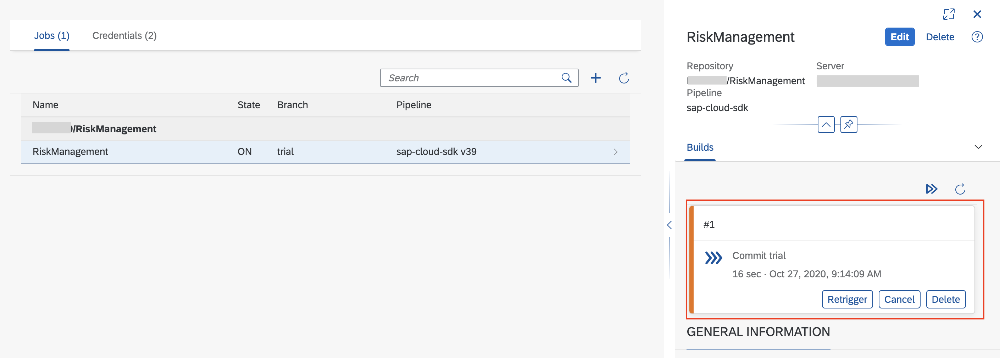
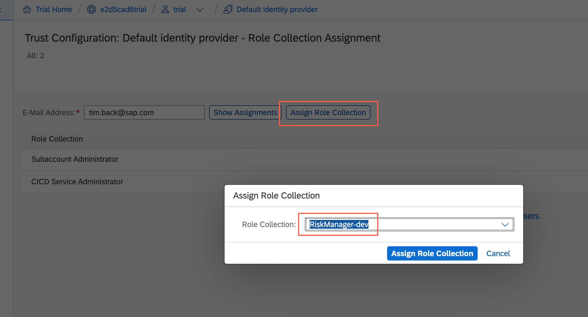
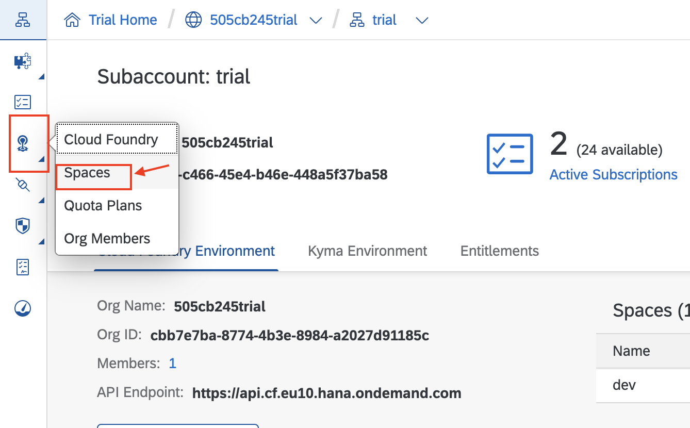

# Exercise 3 - Connect Your Project to SAP Continuous Integration and Delivery 

In this exercise, we will create a project in a public GitHub repository in which to store your source code, enable SAP Continuous Integration and Delivery and configure and run a predefined Continuous Integration and Delivery (CI/CD) pipeline that automatically tests, builds, and deploys your code changes.

## Exercise 3.1 Create a GitHub Repository

After completing these steps, you will have created a public GitHub repository, in which you can store the source code of your project. **Note:** For this execise, you need to have a GitHub user.

1. Open and sign in to https://github.com/.

2. In the **Repositories** tab, choose **New** to create a new repository.

   
3. As **Repository name**, enter *RiskManagement*. Don't tick any of the **Initialize this repository with** checkboxes.

4. Choose **Create repository**.


5. Copy the HTTPS URL of your newly created GitHub repository.


## Exercise 3.2 Create a Personal Access Token for GitHub

After completing these steps, you will have created a personal access token to authenticate against GitHub.

To create a personal access token, which you can use instead of a password, follow the steps described in [Creating a personal access token](https://docs.github.com/en/github/authenticating-to-github/creating-a-personal-access-token).


## Exercise 3.3 Connect Your GitHub Repository with Your CAP Project

After completing these steps, you will have added your CAP project sources to your GitHub repository.

1. If you have Business Application Studio still open from the former exercises, return to it. If you haven't, open your [SAP BTP Trial](https://cockpit.hanatrial.ondemand.com/) and click on the Quick Tool Access icon **SAP Business Application Studio**.



2. Open the previously created workspace with your CAP application.

3. Open a new terminal and navigate to your project root folder.


4. Enter your email address and username. You can use the email address that you've used to register your GitHub account:
   ```
   git config --global user.email "you@example.com"
   git config --global user.name "Your Name"
   ```
5. To initialize a GitHub repository and add the project sources to it, execute the following commands:
    ```
    git init
    git add .
    git commit -m "Push project content to GitHub"
    git branch -M main
    ```

6. Now, add your copied GitHub repository URL from exercise 3.1 as remote repository (without the angle brackets '<' and '>' ):
   ```
   git remote add origin <copied Git repository url.git>
   ```

7. Push the commit with your project content to this GitHub repository:
    ```
    git push -u origin main
    ```

8. When prompted, enter your GitHub username and the personal access token, created in exercise 3.2.


## Exercise 3.4 Enable SAP Continuous Integration and Delivery

After completing these steps, you will have subscribed to SAP Continuous Integration and Delivery and assigned the *Administrator* role to your user.


1. Enter your [SAP BTP trial account](https://cockpit.hanatrial.ondemand.com/), press **Enter Your Trial Account**, press on the **trial** tile and navigate to the **Subscriptions** tab. Go to **Service Marketplace**.

2. Type **Continuous Integration & Delivery** in the search box and click on the service tile:


3. Click **Create**.


4. In your SAP BTP subaccount, choose **Security** → **Trust Configuration**.

5. Click on the name of your identity provider (For example, 'Default identity provider' in this case).

6. Enter your email address.

7. Choose **Show Assignments**.
(If your user is new to your subaccount, choose **Add User** in the confirmation dialog.)

8. Choose **Assign Role Collection**.

9. From the drop-down list, choose **CICD Service Administrator**.


## Exercise 3.5 Configure Credentials in SAP Continuous Integration and Delivery

After completing these steps, you will have configured credentials for connecting SAP Continuous Integration and Delivery to other services.

1. In your SAP BTP subaccount navigate to **Services** and then to **Instances and Subscriptions**.

2. Click on the **Go to Application** icon located next to the **Continuous Integration & Delivery** subscription.



3. Use your credentials to log in to the application.

4. If your GitHub repository is private, configure credentials for it, so that the Continuous Integration & Delivery service can connect to it. (**Note:** If your GitHub repository isn't private, you can skip this step.)

   - In the **Credentials** tab in SAP Continuous Integration and Delivery, choose **+** *(Create Credentials)*.
  
   - For **Name**, enter a freely chosen name for your credential, which is unique in your SAP BTP subaccount. In this example, the name of the credential is *github*.

   - As **Type**, select **Basic Authentication**.

   - For **Username**, enter your Github username.

   - For **Password**, use the personal access token, which you've created in GitHub in exercise 3.3.
   

5. To create credentials for deploying to the SAP Cloud Foundry environment, go to the **Credentials** tab and choose **+** *(Create Credentials)*.


6. For **Name**, enter a freely chosen name for your credentials, which is unique in your SAP BTP subaccount. In this example, the name of the credentials is *cfdeploy*.

7. As **Type**, select **Basic Authentication**.

8. For **Username**, enter your username of your SAP BTP cockpit.

9. For **Password**, use your password of your SAP BTP cockpit.


## Exercise 3.6 Configure a CI/CD Job

After completing these steps, you will have configured a job in SAP Continuous Integration and Delivery.

1. In the **Jobs** tab in SAP Continuous Integration and Delivery, choose **+** *(Create Job)*.


2. For **Job Name**, enter a freely chosen name for your job, which is unique in your SAP BTP subaccount. In this example, the name of the job is *RiskManagment*.

3. For **Repository**, click on **Repository** and enter a name and the URL of your GitHub repository.

4. For **Branch**, enter the GitHub branch from which you want to receive push events.  In this example, the name of the branch is *main*.

5. As **Pipeline**, choose **SAP Cloud Application Programming Model**.

6. Click **Create**.


If the **Webhook Creation** pop-up, which provides you with the data needed to define a webhook in GitHub, doesn't appear automatically, you can open the detailed view of an existing job in the **Jobs** tab and under **General Information**, click on **Risk Management**.


Then click on **Webhook Data**.


The following pop-up window appears:




7. Leave it open and, in your project in GitHub, go to the **Settings** tab.

8. From the navigation pane, choose **Webhooks**.

9. Choose **Add webhook**.


10. Enter the **Payload URL**, **Content type**, and **Secret** from the **Webhook Creation** pop-up in SAP Continuous Integration and Delivery. For all other settings, leave the default values.

11. Choose **Add webhook**.


## Exercise 3.7 Configure the Stages of Your CI/CD Pipeline

After completing these steps, you will have configured the stages of your pipeline in SAP Continuous Integration and Delivery.

1. In the GitHub repository of your project (or in your still open Business Application Studio), create a folder named `.pipeline`, which contains a file named `config.yml`. In the `config.yml` file, add the following initial configuration:

```PipelineConfiguration
# Project configuration
general:
  projectName: 'RiskManagement'
  productiveBranch: 'main'

# Stage configuration
stages:
  productionDeployment:
    cfTargets:
    - org: '<YOUR ORG NAME>'
      space: '<YOUR SPACE NAME>'
      appName: '<NAME OF YOUR APPLICATION>'
      apiEndpoint: '<YOUR CLOUD FOUNDRY API ENDPOINT>'
      credentialsId: '<NAME OF YOUR CEDENTIAL>'
```

2. Replace the placeholders with the values of the space in the Cloud Foundry environment to which you want to deploy.
`<NAME OF YOUR APPLICATION>` is `RiskManagement` and `credentialId` is the name of the credentials you have created before for Cloud Platform access, in the example we used `cfdeploy`.
You can get the values for `<YOUR ORG NAME>`, `<YOUR SPACE NAME>`, and `<YOUR CLOUD FOUNDRY API ENDPOINT>` from your subaccount overview in the SAP BTP cockpit:
 


3. Commit your changes to GitHub. If you have added the new folder and file in the Businss Application Studio, you can do so by opening a new terminal from the new `.pipeline` folder and then by typing

```
git add -A
git commit -m "new pipeline"
git push
```

## Exercise 3.8 Verify the Success of Your Build

After completing these steps, you will have monitored the outcome of your job in SAP Continuous Integration and Delivery.

1. In the **Jobs** tab in SAP Continuous Integration and Delivery, select your job and verify that a new tile appears in the **Builds** view. This tile should be marked as running.

**Note:** If no new tile appears, trigger the job manually by choosing the *Trigger Build* button.


2. Wait until the job has finished and verify that the build tile is marked as successful.


## Exercise 3.9 Assign Role Collections and Access the Deployed Application

After completing these steps, you will have accessed your deployed application trough the SAP BTP cockpit.

As we set it up this way, the deployed service can only be accessed when your user has a corresponing role collection assiged. If you tried to open the application without this authorization you would get a **Forbidden** pop-up. So, you need to assign the role collection to your user:

1. In your trial account in the SAP BTP cockpit, navigate to the **Security** tab and choose **Trust Configuration**. Click on the **Default Entity Provider** link.


2. Enter the email address for your SAP BTP account (the one you used to log on) and press the **Show Assignments** button. Then press the **Assign Role Collection** button and choose **RiskManager-dev** in the dropdown box. Press the **Assign Role Collection** button


Now you are ready to access the application!

3. In the left pane of your trial accoun, navigate to the **Cloud Foundry** tab and choose **Spaces**.


4. Select your space.

5. Verify that the *RiskManagment* application has been deployed and that the `Riskmanagement-approuter` is running (might have a `blue` or something similar in the name as well like in the picture).


6. Choose the `Riskmanagement-approuter`.

7. Choose the link under **Application Routes**.


8. Verify that the deployed application is running and showing its home screen.


9. Press the **Risks** tile and then in the application the **Go** button and you should see the final deployed application with the data:


## Summary

You've created a project in GitHub to store your source code and successfully configured and run a predefined continuous integration and delivery pipeline that automatically builds, tests and deploys your code changes.

